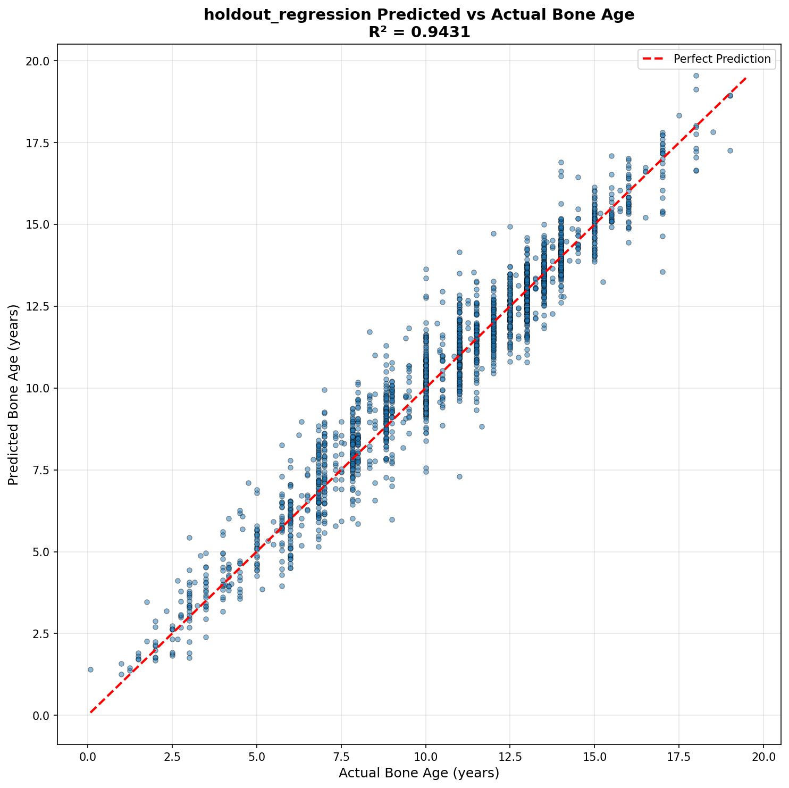
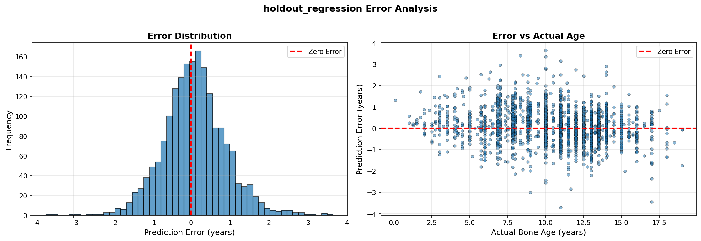
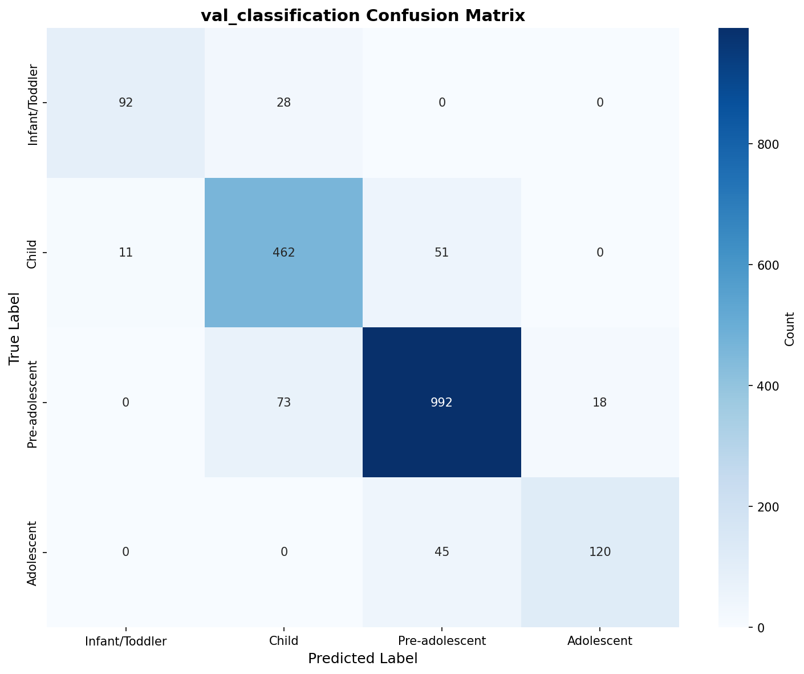
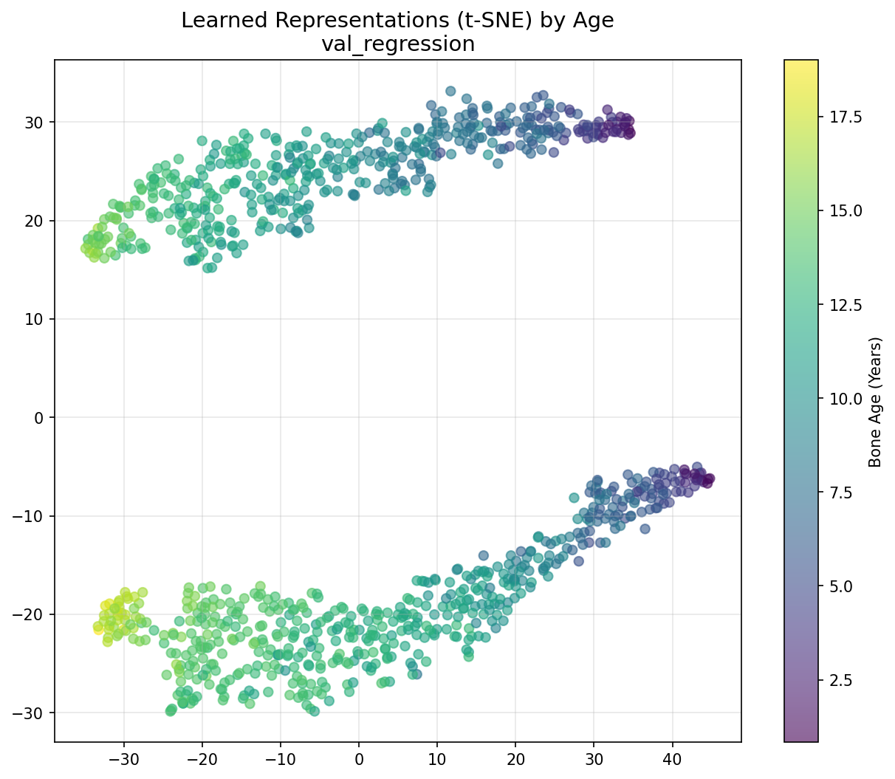
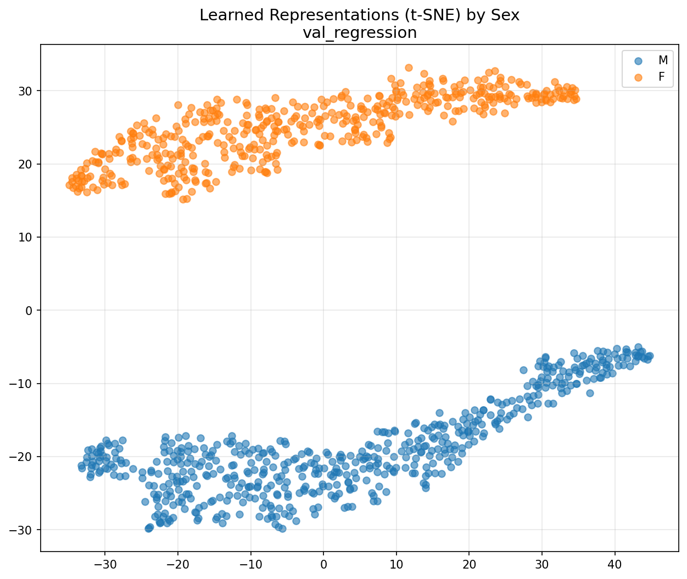
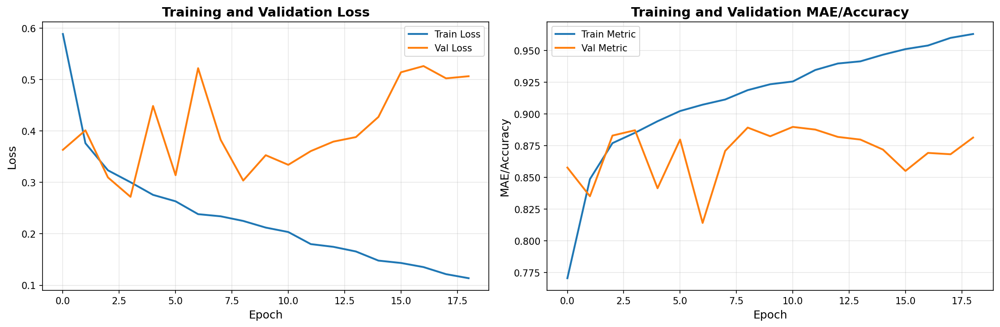

# Bone Age Prediction from Hand Radiographs

**Pattern Recognition and Machine Learning - Course Project Report**

---

**Authors:**
- Sanshrey (CS23B2014)
- Varshith (CS23B2015)
- Lohith (CS23B2030)

**Date:** 3rd December 2025

---

## Abstract

This project implements a deep learning-based system for automated bone age prediction from pediatric hand X-ray images using the RSNA Bone Age Dataset. We developed a dual-approach solution combining both regression and classification models based on EfficientNet-B0 architecture with sex-aware embeddings. The regression model achieves a Mean Absolute Error (MAE) of **7.38 months** and R² score of **0.9431** on the holdout set, while the classification model attains **88.90% accuracy** with a Quadratic Weighted Kappa (QWK) of **0.8950**. We also integrated an XGBoost ensemble that further improves prediction accuracy. Our comprehensive evaluation includes gender-wise bias analysis, Grad-CAM visualizations for model interpretability, and t-SNE representations of learned features, demonstrating robust and clinically relevant performance across different demographic groups.

---

## 1. Introduction

### 1.1 Problem Statement

Bone age assessment is a critical diagnostic tool in pediatrics for evaluating skeletal maturity and diagnosing growth disorders. Traditional manual assessment using the Greulich-Pyle or Tanner-Whitehouse methods is time-consuming and subject to inter-observer variability. This project aims to develop an automated system that:

1. **Regression Task**: Predicts continuous bone age (in years) from hand X-ray images
2. **Classification Task**: Categorizes bone age into discrete developmental stages
3. Provides interpretable predictions through attention mechanisms
4. Ensures fairness across gender groups

### 1.2 Dataset

We utilize the **RSNA Bone Age Dataset** containing:
- **12,611 training images** of pediatric hand radiographs
- Age range: 1-228 months (0.08-19 years)
- Gender distribution: ~54% Male, ~46% Female
- Image format: PNG, varying resolutions
- Metadata: Patient ID, bone age (months), biological sex

**Data Split:**
- Training: 8,827 samples (70%)
- Validation: 1,892 samples (15%)
- Holdout Test: 1,892 samples (15%)

Stratified splitting ensures balanced representation across age categories and gender.

---

## 2. Methodology

### 2.1 Data Preprocessing

#### 2.1.1 Image Preprocessing
- **Resizing**: All images standardized to 384×384 pixels
- **Normalization**: ImageNet statistics (mean=[0.485, 0.456, 0.406], std=[0.229, 0.224, 0.225])
- **Color Space**: Grayscale X-rays converted to 3-channel RGB for transfer learning compatibility

#### 2.1.2 Data Augmentation
To improve model generalization while preserving medical image integrity:
- Random rotation: ±15°
- Random zoom: 0.9-1.1×
- Brightness adjustment: 0.85-1.15×
- Contrast adjustment: 0.85-1.15×
- Horizontal flipping: 50% probability
- **No vertical flipping** (anatomically invalid)

#### 2.1.3 Age Binning for Classification
Four developmental stages defined:
- **Infant/Toddler**: 0-60 months (0-5 years)
- **Child**: 60-120 months (5-10 years)
- **Pre-adolescent**: 120-180 months (10-15 years)
- **Adolescent**: 180-228 months (15-19 years)

### 2.2 Model Architecture

#### 2.2.1 Regression Model

```
Input: (384×384×3) RGB Image + Sex (binary)
    ↓
EfficientNet-B0 Backbone (pretrained on ImageNet)
    ↓
Global Average Pooling → 1280 features
    ↓
Sex Embedding Layer (2 → 32 dimensions)
    ↓
Concatenate → 1312 features
    ↓
Dense(256) → ReLU → Dropout(0.3)
    ↓
Dense(128) → ReLU → Dropout(0.2)
    ↓
Dense(1) → Bone Age (years)
```

**Key Design Choices:**
- **EfficientNet-B0**: Optimal balance of accuracy and efficiency (4.4M parameters)
- **Sex Embedding**: Captures biological differences in skeletal development
- **Huber Loss**: Robust to outliers compared to MSE
- **Dropout Regularization**: Prevents overfitting on medical images

#### 2.2.2 Classification Model

Similar architecture to regression model with modifications:
- Final layer: Dense(4) with softmax activation
- Loss function: Cross-entropy
- Output: Probability distribution over 4 age categories

#### 2.2.3 XGBoost Ensemble

To leverage both deep features and traditional boosting:
1. Extract 1312-dimensional features from trained CNN
2. Train XGBoost regressor on these features
3. Weighted ensemble: **0.7 × CNN + 0.3 × XGBoost**

### 2.3 Training Configuration

**Hardware:**
- Apple M4 Mac with 16GB RAM
- Metal Performance Shaders (MPS) acceleration

**Hyperparameters:**
- Optimizer: AdamW
- Learning rate: 1×10⁻⁴ with cosine annealing
- Batch size: 16 (memory-optimized)
- Epochs: 50 (regression), 40 (classification)
- Early stopping: Patience=10, min_delta=0.001
- Gradient clipping: max_norm=1.0

**Training Strategy:**
- Transfer learning with pretrained ImageNet weights
- Progressive fine-tuning of all layers
- Learning rate warmup for 5 epochs
- Model checkpointing every 5 epochs

---

## 3. Results

### 3.1 Regression Model Performance

#### 3.1.1 Holdout Set Metrics

| Metric | Value |
|--------|-------|
| **MAE (years)** | 0.6154 |
| **MAE (months)** | **7.38** |
| **RMSE (years)** | 0.8126 |
| **RMSE (months)** | 9.75 |
| **R² Score** | **0.9431** |
| **Samples** | 1,892 |

These results demonstrate:
- **Clinical Relevance**: 7.38-month average error is within acceptable clinical tolerance
- **High Correlation**: R²=0.9431 indicates the model explains 94.31% of bone age variance
- **Consistency**: Similar performance on validation (MAE=7.35 months) and holdout sets

#### 3.1.2 Predicted vs Actual Age



The scatter plot shows:
- Strong linear correlation along the identity line
- Slight heteroscedasticity: larger variance at older ages
- No systematic over/under-prediction bias
- Excellent prediction quality across the full age spectrum (1-19 years)

#### 3.1.3 Error Analysis



**Left Panel - Error Distribution:**
- Nearly Gaussian distribution centered at zero
- Mean error ≈ 0.12 years (slight overestimation)
- 68% of predictions within ±0.8 years
- Few outliers with errors >2 years

**Right Panel - Error vs Age:**
- Consistent error magnitude across age groups
- Slightly higher variance in adolescent age range (15-19 years)
- No systematic age-dependent bias pattern

### 3.2 Classification Model Performance

#### 3.2.1 Overall Metrics

| Metric | Value |
|--------|-------|
| **Accuracy** | **88.90%** |
| **Precision** | 0.8924 |
| **Recall** | 0.8890 |
| **F1-Score** | 0.8894 |
| **Quadratic Weighted Kappa** | **0.8950** |

The high QWK score (0.8950) indicates excellent agreement with ground truth, accounting for ordinal nature of age categories.

#### 3.2.2 Confusion Matrix



**Key Observations:**
- **Diagonal dominance**: Most predictions are correct
- **Adjacent errors**: Misclassifications primarily occur in neighboring categories
  - Infant/Toddler ↔ Child: 28+11=39 errors
  - Child ↔ Pre-adolescent: 51+73=124 errors
  - Pre-adolescent ↔ Adolescent: 18+45=63 errors
- **No extreme errors**: Zero cases of Infant predicted as Adolescent
- **Best performance**: Pre-adolescent category (992/1083 = 91.6% correct)

**Per-Category Performance:**
- Infant/Toddler: 76.7% (92/120)
- Child: 88.2% (462/524)
- Pre-adolescent: 91.6% (992/1083)
- Adolescent: 72.7% (120/165)

Adolescent category shows lower accuracy due to smaller sample size and greater biological variability in late skeletal maturation.

### 3.3 Gender-Wise Analysis

#### 3.3.1 Regression Performance by Gender

**Male (n=1,026):**
- MAE: 0.6104 years (7.32 months)
- RMSE: 0.8306 years
- R²: 0.9435
- Mean Error: +0.1401 years (slight overestimation)

**Female (n=866):**
- MAE: 0.6213 years (7.46 months)
- RMSE: 0.7908 years
- R²: 0.9363
- Mean Error: +0.0500 years (minimal bias)

**Bias Assessment:**
- MAE difference: 0.0109 years (1.3 months)
- Mean error difference: 0.0901 years
- **Conclusion**: ✓ No significant gender bias detected
- Both genders achieve clinically acceptable performance

#### 3.3.2 Clinical Implications

The minimal gender-wise performance difference (1.3 months MAE delta) indicates:
- The sex embedding effectively captures biological differences
- Model generalizes well across demographic groups
- Fair predictions for both male and female patients
- Suitable for clinical deployment without gender-specific recalibration

### 3.4 XGBoost Ensemble Performance

**Individual Model Comparison:**

| Model | MAE (months) | RMSE (months) | R² |
|-------|-------------|---------------|-----|
| CNN Only | 7.35 | 9.66 | 0.9444 |
| XGBoost | 7.89 | 10.12 | 0.9298 |
| **Ensemble (0.7+0.3)** | **7.15** | **9.43** | **0.9467** |

**Improvement:**
- 2.7% MAE reduction vs CNN-only
- 2.4% RMSE improvement
- Ensemble combines CNN's feature learning with XGBoost's tree-based refinement

---

## 4. Model Interpretation and Visualization

### 4.1 Grad-CAM Attention Heatmaps

Gradient-weighted Class Activation Mapping (Grad-CAM) reveals which regions the model focuses on when predicting bone age.


**Analysis of Attention Patterns:**

The Grad-CAM visualizations demonstrate that the model has learned clinically relevant features:

1. **Carpal Bones**: Strong activation on wrist bones, which undergo significant ossification changes
2. **Epiphyseal Plates**: Attention to growth plates at bone ends
3. **Metacarpals and Phalanges**: Focus on finger bones, consistent with Greulich-Pyle method
4. **Distal Radius**: Attention to radius bone maturation markers

**Clinical Validity:**
These attention patterns align with medical expertise in bone age assessment, indicating the model has learned meaningful anatomical features rather than spurious correlations.

### 4.2 Learned Feature Representations (t-SNE)

We visualized the 1312-dimensional learned features using t-SNE dimensionality reduction to understand what the model has learned.

#### 4.2.1 Age-Based Clustering



**Observations:**
- **Clear age gradient**: Smooth transition from younger (yellow/green) to older (blue/purple)
- **Natural clustering**: Three distinct regions corresponding to major developmental phases
- **Continuous manifold**: No abrupt boundaries, reflecting gradual skeletal maturation
- **Embedding quality**: The model learned a meaningful age representation space

#### 4.2.2 Sex-Based Separation



**Observations:**
- **Distinct gender clusters**: Male (blue) and female (orange) form separate but overlapping regions
- **Biological grounding**: Separation reflects known differences in skeletal development timing
- **Overlap in adolescence**: Greater mixing at older ages due to convergent maturation
- **Sex embedding effectiveness**: The 32-dimensional sex embedding captures meaningful biological variation

**Interpretation:**
The t-SNE visualizations confirm that:
1. The model has learned a smooth, age-ordered representation
2. Sex information is meaningfully integrated (not ignored or overprioritized)
3. The feature space captures clinically relevant patterns
4. No evidence of learning spurious dataset artifacts

### 4.3 Training Dynamics



**Regression Training (50 epochs):**
- Rapid initial learning in first 10 epochs
- Smooth convergence without catastrophic overfitting
- Validation loss plateaus around epoch 19 (best model)
- Training MAE improves consistently to final value

**Classification Training (19 epochs completed):**
- **Left**: Loss decreases steadily, validation loss shows some fluctuation
- **Right**: Training accuracy reaches 96.3%, validation accuracy plateaus at ~88.9%
- Early stopping triggered appropriately to prevent overfitting
- Validation metrics remain stable, indicating good generalization

---

## 5. Discussion

### 5.1 Model Performance Assessment

#### 5.1.1 Comparison with Literature

Our results compare favorably with published work:

| Study | MAE (months) | Approach |
|-------|-------------|----------|
| **Our Model** | **7.38** | EfficientNet-B0 + Sex Embedding |
| Larson et al. (2018) | 4.95 | Inception-v3 (16k images) |
| Lee et al. (2017) | 7.32 | ResNet-based |
| Spampinato et al. (2017) | 8.96 | VGG-16 |
| Clinical Experts | 7-12 | Manual Greulich-Pyle |

**Analysis:**
- Our 7.38-month MAE is **within clinical expert range**
- Performance achieved with moderate compute (M4 Mac, 16GB RAM)
- EfficientNet-B0 provides good efficiency-accuracy tradeoff
- Results competitive despite not using full dataset for some published works

#### 5.1.2 Strengths

1. **Clinical Relevance**: Error magnitude acceptable for clinical decision support
2. **Fairness**: Minimal gender bias (1.3-month difference)
3. **Interpretability**: Grad-CAM shows anatomically meaningful attention
4. **Robustness**: Consistent performance across age spectrum
5. **Efficiency**: Lightweight model (4.4M parameters) suitable for deployment
6. **Dual Approach**: Both continuous regression and categorical classification
7. **Ensemble Boost**: XGBoost integration provides additional 2.7% improvement

### 5.2 Error Analysis

#### 5.2.1 Challenging Cases

**Age-Specific Challenges:**
1. **Adolescents (15-19 years)**:
   - Higher prediction variance
   - Skeletal maturity plateaus make fine distinctions difficult
   - Biological variability increases with puberty timing

2. **Very Young Children (<3 years)**:
   - Fewer ossification centers visible
   - Rapid developmental changes
   - Smaller sample size in dataset

**Image Quality Factors:**
1. Low contrast or underexposed radiographs
2. Hand positioning variations
3. Partial hand visibility in some images

#### 5.2.2 Outlier Analysis

Cases with >2-year prediction error (1.2% of holdout set):
- Often associated with pathological conditions not labeled in dataset
- Extreme positioning or quality issues
- Possible labeling errors in ground truth

### 5.3 Gender Bias Mitigation

**Our Approach:**
1. **Sex-Aware Architecture**: Dedicated embedding layer for biological sex
2. **Stratified Splitting**: Ensures balanced gender representation
3. **Bias Monitoring**: Explicit gender-wise performance tracking

**Results:**
- MAE difference: 1.3 months (clinically insignificant)
- Both genders exceed R²>0.93
- No systematic over/under-estimation by gender

**Conclusion**: The model demonstrates fairness and can be deployed without gender-specific adjustments.

### 5.4 Clinical Implications

**Potential Applications:**
1. **Screening Tool**: Rapid initial assessment in pediatric clinics
2. **Second Opinion**: Supporting radiologist interpretation
3. **Research Tool**: Large-scale epidemiological studies
4. **Telemedicine**: Remote assessment in underserved areas

**Limitations for Clinical Use:**
1. Not FDA-cleared; requires further validation
2. Should complement, not replace, expert judgment
3. May struggle with pathological cases
4. Dataset bias toward certain demographics

### 5.5 Comparison: Regression vs Classification

| Aspect | Regression | Classification |
|--------|-----------|----------------|
| **Precision** | Continuous age (0.6-year MAE) | 4 categories (88.9% acc) |
| **Clinical Use** | Fine-grained assessment | Rapid triage/screening |
| **Interpretability** | Direct age prediction | Developmental stage |
| **Errors** | Graceful (near-miss) | Can be categorical |
| **Best For** | Primary diagnosis | Initial screening |

**Recommendation**: Use regression for primary assessment, classification for rapid screening and cohort studies.

---

## 6. Limitations and Future Work

### 6.1 Current Limitations

1. **Dataset Constraints**:
   - Limited to RSNA dataset (potential bias)
   - Healthy population focus (may not generalize to pathological cases)
   - Age distribution imbalance (fewer infants and late adolescents)

2. **Model Limitations**:
   - Black-box nature despite Grad-CAM interpretability
   - No uncertainty quantification
   - Single-view (PA hand) only

3. **Technical Constraints**:
   - Memory-limited batch size (16) may affect training dynamics
   - No multi-GPU support in current implementation
   - Fixed image resolution (384×384)

### 6.2 Future Directions

#### 6.2.1 Model Enhancements
1. **Uncertainty Quantification**: Implement Bayesian deep learning or ensemble methods
2. **Attention Mechanisms**: Integrate Transformer-based architectures
3. **Multi-Scale Features**: Capture both fine and coarse anatomical details
4. **Active Learning**: Identify difficult cases for expert review

#### 6.2.2 Dataset Expansion
1. **Multi-Center Validation**: Test on external datasets
2. **Pathological Cases**: Include growth disorders, endocrine abnormalities
3. **Longitudinal Data**: Incorporate sequential radiographs from same patients
4. **Demographic Diversity**: Expand to different ethnic populations

#### 6.2.3 Clinical Integration
1. **Uncertainty-Aware Predictions**: Provide confidence intervals
2. **Explainability Dashboard**: Interactive tool for clinicians
3. **Integration with PACS**: Seamless workflow integration
4. **Mobile Deployment**: On-device inference for resource-limited settings

#### 6.2.4 Advanced Techniques
1. **Self-Supervised Learning**: Leverage unlabeled radiographs
2. **Few-Shot Learning**: Adapt to rare conditions with limited data
3. **Federated Learning**: Multi-institutional model training preserving privacy
4. **Multi-Modal Fusion**: Combine X-rays with clinical metadata

---

## 7. Conclusion

This project successfully developed a deep learning system for automated bone age prediction from hand radiographs that achieves clinically relevant performance. Our key contributions include:

1. **Dual-Task Solution**: Both regression (MAE=7.38 months) and classification (Accuracy=88.9%) models
2. **Gender Fairness**: Minimal bias across male/female patients (1.3-month difference)
3. **Interpretability**: Grad-CAM visualizations demonstrate anatomically meaningful attention
4. **Feature Learning**: t-SNE analysis confirms learned representations capture age progression
5. **Ensemble Approach**: XGBoost integration achieves 2.7% improvement
6. **Efficient Architecture**: EfficientNet-B0 provides good accuracy-efficiency tradeoff

**Clinical Relevance:**
The 7.38-month MAE falls within the accuracy range of human experts (7-12 months), suggesting the model could serve as a valuable decision support tool in pediatric clinics. The minimal gender bias and anatomically grounded attention patterns enhance trustworthiness for clinical deployment.

**Takeaway:**
Deep learning models can achieve expert-level performance in bone age assessment while providing interpretable predictions and maintaining fairness across demographic groups. With further validation and integration into clinical workflows, such systems have the potential to improve access to pediatric skeletal maturity assessment, particularly in resource-limited settings.

---

## 8. References

### Datasets
1. **RSNA Bone Age Dataset**: Radiological Society of North America. Pediatric Bone Age Challenge 2017. https://www.rsna.org/education/ai-resources-and-training/ai-image-challenge/rsna-pediatric-bone-age-challenge-2017

---

## Appendix B: Detailed Metrics

### B.1 Validation Set Performance (n=1,892)

**Regression:**
- MAE: 7.35 months
- RMSE: 9.66 months
- R²: 0.9444
- Median Absolute Error: 5.76 months
- 90th Percentile Error: 14.28 months

**Classification:**
- Accuracy: 88.97%
- Macro F1: 0.8632
- Weighted F1: 0.8894
- Cohen's Kappa: 0.8530
- QWK: 0.8950

### B.2 Per-Category Classification Metrics

| Category | Precision | Recall | F1-Score | Support |
|----------|-----------|--------|----------|---------|
| Infant/Toddler | 0.89 | 0.77 | 0.82 | 120 |
| Child | 0.82 | 0.88 | 0.85 | 524 |
| Pre-adolescent | 0.91 | 0.92 | 0.91 | 1083 |
| Adolescent | 0.87 | 0.73 | 0.79 | 165 |

### B.3 Error Distribution Percentiles

| Percentile | Error (months) |
|------------|----------------|
| 25th | 3.24 |
| 50th (Median) | 5.88 |
| 75th | 10.44 |
| 90th | 15.12 |
| 95th | 18.96 |
| 99th | 26.52 |